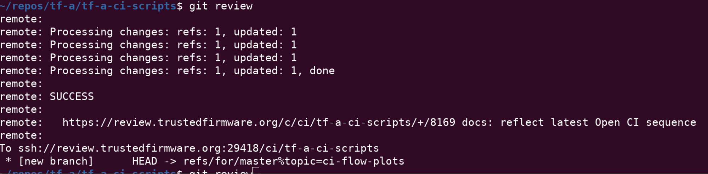
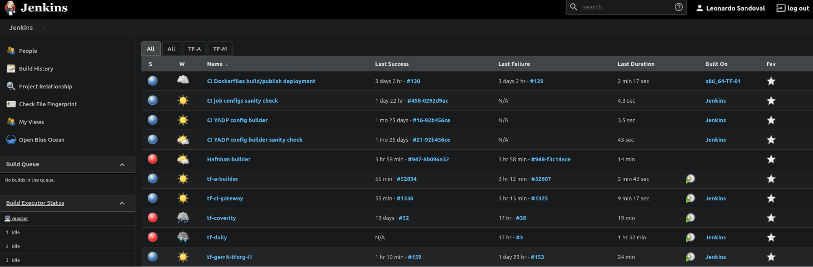
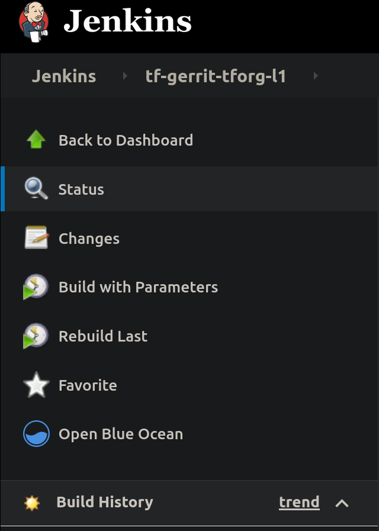
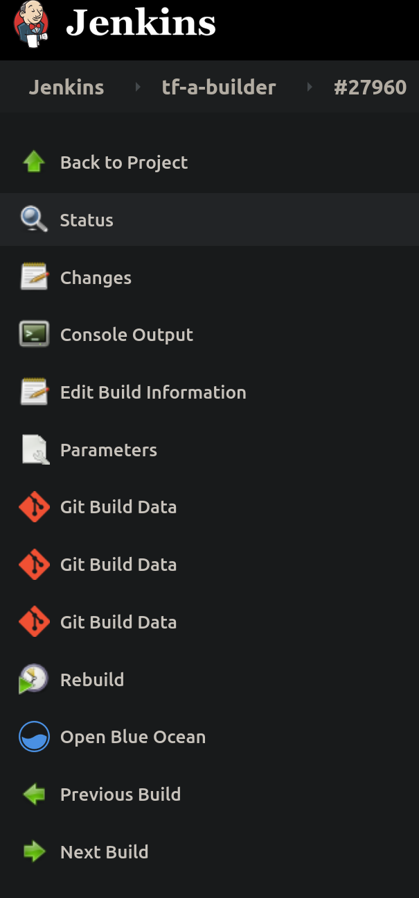

<header>
TrustedFirmware OpenCI Users Guide
</header>

**Table of Contents**
[Intro](#users-guide)

How to Contribute Code	4
Gerrit Setup	4
Commit and review	5
From the maintainer's POV	6
Manual Job trigger	7
LAVA documentation	8
Supported platforms	8
TF-A supported platforms	8
TF-M supported platforms	9
How to navigate tf.validation.linaro.org	9
How to read a job and investigate results	10
Pipeline description	12
TF-A CI pipeline description	12
TF-M CI pipeline description	18
TF-M Job dependencies	19
The TF Jenkins Job Builder (JJB) configs	20
JJBs and Jenkins Jobs	21
Calling CI scripts from JJB jobs	21
CI Scripts overview	23
TF-A CI scripts overview	23
TF-M CI scripts overview	26
TF LAVA Instance	27
TF LAVA instance replication	27
LAVA Master	28
LAVA Dispatchers	28
Upgrades	28
LAVA instance changes	28
Current list of available devices	29
Local LAVA instance set up	29
New device enablement in LAVA	29
Board setup	29
Juno	29
Peripherals	29
Deployment	29
Troubleshooting	29
MPS2	30
Peripherals	30
Deployment	30
Troubleshooting	30
Musca B1	31
Flashing the device for the first time.	31
Turn on automation	31
Turn auto power on	31
Adding Boards to LAVA	31
Hardware Requirements	31
How to get your board installed in the Linaro Cambridge Lab	32
TF LAVA instance - tf.validation.linaro.org	33
TF LAVA instance replication	33
LAVA Master	34
LAVA Dispatchers	34
Upgrades	34
LAVA instance changes	34
Current list of available devices	35
Local LAVA instance set up	35
New device enablement in LAVA	35
Board setup	35
Juno	35
Peripherals	35
Deployment	35
Troubleshooting	35
MPS2	36
Peripherals	36
Deployment	36
Troubleshooting	36
Musca B1	37
Flashing the device for the first time.	37
Turn on automation	37
Turn auto power on	37
SQUAD	38
TF-A	38
TF-M	38
Staging Trusted Firmware System	39
Brief description of the setup	39
Rules & Environment setup	39
How to setup basic next environment	40
Workflow for next/tf-a-job-configs.git	41
Workflow for other repositories	42
Misc Info	43
Relevant Tickets	43
Slides	43

<a name="users-guide"/>

# User Guide
This Google Document is a draft for development and review. Once reviewed, the doc will be made available on Phabricator on the trustedfirmware.org website where additional content will be added and reviewed.

This guide briefly explains how to use and contribute to the Trusted Firmware project https://www.trustedfirmware.org/, in particular the Trusted Firmware A https://www.trustedfirmware.org/projects/tf-a/ and Trusted Firmware M https://www.trustedfirmware.org/projects/tf-m/. 

## How to Contribute Code
The Trusted Firmware core projects, TF-M and TF-A, are both open source projects and both share the same way to accept user contributions.  Code changes, commonly known as patches or patchsets, are git-tracked so once the corresponding project is cloned, all content (history of previous patches which now are commits) is available at the user's machine.

TF projects use Gerrit https://review.trustedfirmware.org/dashboard/self as a centralized system to push, update, review and review patches. Contributors must push their patches to gerrit, so CI and reviewers can see the proposed change. One can see the open ones at https://review.trustedfirmware.org/q/status:open. 


Once a patch is approved, one of the core maintainers merges it to the main branch (master) through Gerrit. The same cycle is repeated for every patch, where a patch series may be merged in one step.

Mailing lists  https://lists.trustedfirmware.org/mailman/listinfo/tf-a https://lists.trustedfirmware.org/mailman/listinfo/tf-m are used to communicate latest news and also it is the main channel for users to post questions or issues, so it is a good idea to subscribe to these. Note, the mailing lists are not intended for patch reviews, so patches should go into Gerrit and news/questions/issues through the mailing lists.

### Gerrit Setup

Once the project is cloned, there are some two extra steps to setup gerrit properly: 1. setting up the gerrit remote repository and 2. Git-review package installation

For example, under the TF-A project, use the following command  to add the remote

$ git remote add gerrit ssh://<gerrit user>@review.trustedfirmware.org:29418/TF-A/trusted-firmware-a

For TF-M, the same command applies except that remote’s url is a bit different

$ git remote add gerrit ssh://<gerrit user>@review.trustedfirmware.org:29418/TF-M/trusted-firmware-m

As a safety check, run the command git remote -v and make sure gerrit remote is present. The next step is to install the git-review package in your corresponding Linux distribution.  For example, on Ubuntu this would be

$ sudo apt install git-review

and finally define the gerrit remote to be used with the following command

$ git review -r

If no issues are found at this point, you should be ready to start contributing to the project!

### Commit and review

No matter what change you want to make in any repository, one needs to create one or more commits into a local branch before submission. All commits must have ‘Signed-off-by’ and ‘Change-id’ strings in the commit description otherwise submission fails. The ‘Signed-off-by’ is introduced explicitly by the user (git commit -s) and the ‘Change-id’ automatically created by the git-review plugin. Patches should be atomic, just targeting one task. A commit’s subject should answer the question ‘what changed’ and the commit’s description answers the question ‘why it changed’. Be clear and always use present verbs, i.e use Add instead of Adding.

Once your commits are ready, type

git review

This command takes care of all the internal commands needed to send the patch to Gerrit, as seen below:



Once a patch is submitted, you must include one or more reviewers. The question then raises: who should I add as a reviewer? One  simple approach would be to look at the git history of the files you are modifying, and look for authors who have committed recently.

git log <path to file>

Once reviewers are included, you would probably get some feedback pretty soon. TF projects are quite active but in case you do not get any activity in a couple of days, reply from Gerrit indicating that you would like some feedback. Take the time to understand and review every comment and response properly, do corrections and update the patch promptly if required. Keep polishing the patch until all feedback/observations are resolved. A good practice is to create a new branch for each patch update (suffix a version number on the branch name) so one can switch back and forth between patch versions. CI output and reviewers’ comments are reflected in gerrit and email (the one that appears in your patch metadata), so be sure to check any of these after submission.

More details about Gerrit can be found in the upstream documentation:
	https://gerrit-documentation.storage.googleapis.com/Documentation/3.3.1/index.html

## From the maintainer's POV

All CI is done with Jenkins at https://ci.trustedfirmware.org/. There are lots of jobs so as a first impression, it is difficult to follow the CI flow. Section 4, Pipeline description, describes each project’s CI in detail.



Each project, TF-A and TF-M, have different CI jobs and scripts hosted in the following repos

* TF-A CI Jobs https://git.trustedfirmware.org/ci/tf-a-job-configs.git/
* TF-A CI Scripts https://git.trustedfirmware.org/ci/tf-a-ci-scripts.git/
* TF-M CI Jobs https://git.trustedfirmware.org/ci/tf-m-job-configs.git/
* TF-M CI Scripts https://git.trustedfirmware.org/ci/tf-m-ci-scripts.git/

The job config repositories contain Jenkins Job Definitions, called JJB (Jenkins Job Builders) files. The  CI scripts repositories host scripts that are required for the CI, i.e build scripts, static checks, etc.

## Manual Job trigger

For patches that arrive at gerrit, the CI is explicitly triggered by a core maintainer. However there are cases where a particular job needs to be rebuilt. Jobs can be rebuilt at any level, from the trigger job to the job that builds or launches the LAVA execution. For example, the below picture shows a trigger job with the ‘Build with Parameters’ and ‘Rebuild last’ options. Both options allow the maintainer to change any job parameter before actually executing it.



Most  probably, you may want to go to a specific failed job and ‘Rebuild’



There may be many reasons to rebuild but perhaps the most trivial one is to make sure the error is valid and not a transient one. Look at the job’s console for errors.

# LAVA documentation

## Supported platforms

TF project support the following platforms in LAVA https://tf.validation.linaro.org/scheduler/device_types


### TF-A supported platforms

Until recently, the only supported platform was the Juno board but now it also supports FVP models:
https://tf.validation.linaro.org/scheduler/device_type/juno
https://tf.validation.linaro.org/scheduler/device_type/fvp

FVP models are virtual platforms that are able to emulate specific Arm reference designs or platforms. See the Arm documentation for more details: https://developer.arm.com/tools-and-software/simulation-models/fixed-virtual-platforms 

These models are present on several docker images and LAVA uses these to boot and test a particular model. The specific docker image and model type is defined at the (LAVA)  job definition. Docker images (containing the models) are available in a private docker registry (987685672616.dkr.ecr.us-east-1.amazonaws.com) that LAVA has access. At the time of this writing,  these are the docker image names

fvp:fvp_base_revc-2xaemv8a_11.12_38
fvp:foundation_platform_11.12_38
fvp:fvp_arm_std_library_11.12_38

Tag name, i.e. fvp_base_revc-2xaemv8a_11.12_38, corresponds to the particular model download from https://developer.arm.com/tools-and-software/simulation-models/fixed-virtual-platforms.


### TF-M supported platforms

TF-M LAVA devices are:
mps https://tf.validation.linaro.org/scheduler/device_type/mps
musca_b https://tf.validation.linaro.org/scheduler/device_type/musca-b
qemu https://tf.validation.linaro.org/scheduler/device_type/qemu. 

## How to navigate tf.validation.linaro.org

All LAVA jobs triggered by Jenkins are executed at the TF LAVA lab https://tf.validation.linaro.org/ instance. The Jenkins jobs that launches LAVA jobs are tf-a-builder https://ci.trustedfirmware.org/job/tf-a-builder/ and tf-m-lava-submit https://ci.trustedfirmware.org/job/tf-m-lava-submit/. The Jenkins jobs contain the corresponding LAVA id which can be used to find the corresponding job at https://tf.validation.linaro.org/. In case of tf-a-builder job, the LAVA log itself is fetched from LAVA lab and attached to the job as seeing below


At the https://tf.validation.linaro.org/scheduler/alljobs jobs site, one can go to a particular job check results directly from LAVA


One powerful feature is the possibility to resubmit jobs: this enables the user to quickly modify a job definition and test it without the need to retriggered from Jenkins.


## How to read a job and investigate results

The entrypoint to read a job failure is looking at the job’s landing page, i.e. https://tf.validation.linaro.org/scheduler/job/74086 


Depending on the device type and job definition, the output can vary considerably. One can filter out relevant logs by clicking the different log levels. As in any system, failures can occur at any time and for different reasons, i.e introduced by a user's patch or scripts/infrastructure. In any case, a core maintainer should monitor and report or fix it accordingly.

# Pipeline description

The TF Open CI project is divided into two separate projects, each handling the respective project. Each is different in design so we describe each separately.

## TF-A CI pipeline description

The TF-A CI pipeline https://git.trustedfirmware.org/ci/tf-a-job-configs.git/ had a refactor based on https://developer.trustedfirmware.org/w/collaboration/openci/, going from testing a single test configuration to hundreds of them. Besides improving considerably the QA, it added some complexity as we will see below.

At the time of this writing, there are two (mostly) identical CIs, one running inside Arm https://jenkins.oss.arm.com/ (Internal CI) and one at https://ci.trustedfirmware.org/ (Open CI). These are two CI instances running in parallel but in different environments: the internal CI runs in a single node (master node) while the Open CI in multiple nodes (docker nodes). In the near future, only the Open CI will be running once all the internal CI features are fully migrated.

Below is a general picture of the Trusted firmware A CI flow. Top boxes are Jenkins jobs, except those with .sh extensions. 


The first job, the trigger-job, can be any job defined below, each covering a set of platforms and build/run configurations through test groups (TEST_GROUPS),  ultimately splitted as test descriptions (TEST_DESC). A  test description is tested by tf-a-builder job and a LAVA job is launched once artifacts are ready to be consumed.

In terms of the trigger source, jobs can be classified by either gerrit or scheduled

Gerrit:
tf-gerrit-tforg-l1: multijob, Allow +1, TF-A
tf-gerrit-tforg-l2: multijob, Allow +2, TF-A
tf-tftf-gerrit-tforg-l1: multijob, Allow +1, TF-A-tests
tf-tftf-gerrit-tforg-l2: multijob, Allow +2, TF-A-tests
Scheduled: daily triggered
tf-daily: scheduled daily

All the above jobs rely on downstream jobs, 

tf-main: multijob, TF-A and TF-A-tests
tf-coverity: freestyle, runs coverity scan
tf-static-checks: runs Arm static code checks
tf-ci-gateway: split a test group (TEST_GROUPS) into multiple ‘.test’ files, each representing a test description (TEST_DESC)
tf-a-builder: freestyle, builds the package and launch a LAVA job

Any job can be triggered manually by authorized users. Gerrit jobs are those triggered on behalf of gerrit actions, either ‘Allow +1’ or ‘Allow +2’, and track a particular project, either TF-A https://git.trustedfirmware.org/TF-A/trusted-firmware-a.git/ or TF-A tests https://git.trustedfirmware.org/TF-A/tf-a-tests.git/. The following screenshot shows and example of the tf-gerrit-tforg-l1 job at the Jenkins instance


The tf-gerrit-tforg-l1 indicates the tracking project, tf-gerrit-tforg-l1, and the level, tf-gerrit-tforg-l1. Levels indicate testing depth (test descriptions coverage) and are used in different phases in the development phase as seen below


The job tf-daily runs daily, uses the latest code (the HEAD commit) and triggers two jobs: tf-main and tf-coverity. The job tf-main is the one covering most platforms so it takes longer to complete (approximately 1.5 hours)


Notice that the  tf-main job also triggers tf-static-checks, the job that launches project-related static checks (copyright presence, headers in alphabetical order, line endings, coding style and banned APIs) and execute Clang static analyzer (scan-build). The job tf-coverity runs the Coverity static code check and reports metrics (defects) at https://scan.coverity.com/projects/arm-software-arm-trusted-firmware?tab=overview

The job tf-a-builder is the builder job and its execution is containerized inside  docker-amd64-tf-a-bionic defined at https://git.trustedfirmware.org/ci/dockerfiles.git/ repository. Anyone can fetch it with the following command and use it for local compilation

docker pull trustedfirmware/ci-amd64-ubuntu:bionic

The result of tf-a-builder is a set of artifacts: binaries, build log, environment files, etc.


In particular, if build produces a LAVA definition file, job.yaml, a LAVA job is launched through SQUAD https://qa-reports.linaro.org/tf/. Once the LAVA job finishes, jenkins fetches the log from LAVA and stores it in the corresponding jenkins job. It is worth mentioning that not all tf-a-builder jobs produce a LAVA job, i.e fvp model not supported, ‘nil’ run configuration provided in the test description, static check, etc. however most FVP and Juno produce one. One can see all executed LAVA jobs at https://tf.validation.linaro.org/scheduler/alljobs.

Finally, depending on the CI execution outcome, this is reflected in gerrit as ‘TrustedFirmware Core Review’ comments


Results from those LAVA executed jobs on behalf of the corresponding gerrit patch are also reflected in gerrit


In case of a job failure, it is more likely that you want to investigate the issue starting at the gerrit job, then following the CI job chain starting from the trigger job (top-bottom approach): 1. analyze results from the gerrit job, 2. use the report table produced by each tf-ci-gateway job, 3. the tf-a-builder job and finally 4. the tf-a-builder’s console. Looking at the following screenshot should help clarifying this concept

Gerrit job level:


tf-ci-gateway level:


tf-a-builder level:


tf-a-builder’s console view:


## TF-M CI pipeline description

TF-M jobs are found at https://ci.trustedfirmware.org/ and can be classified depending on the code coverage

Release job: active during release stage, manually triggered. XL size
Nightly job: active everyday to cover latest HEAD; in case of failure, notification is done through the tf-m mailing list. M size
Per-patch job: gerrit patch verify before merge. Size S

Below is a diagram that shows their relationship and the amount of code coverage targeted.


Jobs can also be classified depending on their specific task:

Production jobs
tf-m-builds-docs-nightly
tf-m-build-and-test
tf-m-coverity
tf-m-static-checks
tf-m-nightly (scheduled)
tf-m-static (per-patch)
tf-m-build-docs
tf-m-build-config
tf-m-lava-submit
tf-m-cppcheck
tf-m-checkpatch
Release jobs
tf-m-release (release)
tf-m-code-coverage
Infra jobs
tf-m-infra-health
tf-m-build-config-infra-health

### TF-M Job dependencies

When a patch arrives at https://review.trustedfirmware.org/ and reviewed, a maintainer may allow the CI to be executed, which in turn triggers tf-m-static. This is exactly the same CI workflow as TF-A. In case of failure, the job cannot be merge into the stable branch. The tf-m-static triggers many more jobs as seen in the picture below


The job tf-m-nigthly is a more extensive job,  triggered everyday and tests the latest code (HEAD) at the project


In case the nightly job fails, an email notification is sent through the mailing list https://lists.trustedfirmware.org/mailman/listinfo/tf-m-ci-notifications . The maintainer is responsible for looking at the failed errors and identifying the (commit) culprit then reporting it to the developer.

## The TF Jenkins Job Builder (JJB) configs

The TF project uses yaml files to define Jenkins jobs (JJB) https://docs.openstack.org/infra/jenkins-job-builder/definition.html. Jobs currently defined for both projects are at https://git.trustedfirmware.org/ci/tf-m-job-configs.git/ and https://git.trustedfirmware.org/ci/tf-a-job-configs.git/. Job triggers are special types of jobs that listen to certain gerrit events. For example the job https://git.trustedfirmware.org/ci/tf-a-job-configs.git/tree/tf-gerrit-tforg-l1.yaml triggers every time a TF-A maintainer ‘Allows +1’ the CI to execute as defined the job’s trigger section 

```
.
.
.
	triggers:	
	- gerrit:	
	server-name: review.trustedfirmware.org
    	trigger-on:
      		- comment-added-event:
          	approval-category: "Allow-CI"
          	approval-value: 1
    	projects:	
    	- project-compare-type: PLAIN
      		project-pattern: TF-A/trusted-firmware-a
      		branches:
        		- branch-compare-type: PLAIN
          		branch-pattern: integration
```

## JJBs and Jenkins Jobs

JJB defines the behaviour of a Job through a YAML file, where Jenkins use these to create jobs (it is similar to Class and Object concepts in Object Oriented Programming). For example this is JJB of TF-A L1 trigger https://git.trustedfirmware.org/ci/tf-a-job-configs.git/tree/tf-gerrit-tforg-l1.yaml which is instanciated at  https://ci.trustedfirmware.org/job/tf-gerrit-tforg-l1/. Similar pattern applies for the rest of the JJB files.

## Calling CI scripts from JJB jobs

JJB files themselves do not do much unless they execute something useful. CI scripts are kept in separate repositories depending on the project. Below is the relationship between jobs and scripts repositories per project

* TF-A CI Jobs https://git.trustedfirmware.org/ci/tf-a-job-configs.git/
* TF-A CI Scripts https://git.trustedfirmware.org/ci/tf-a-ci-scripts.git/
* TF-M CI Jobs https://git.trustedfirmware.org/ci/tf-m-job-configs.git/
* TF-M CI Scripts https://git.trustedfirmware.org/ci/tf-m-ci-scripts.git/

In general, Jenkins jobs call scripts, the latter do the corresponding task. For example, below is shown again CI flow for the TF-A project


Where builders.sh is just a setup script (located at TF-A jobs repo) that finally calls run_local_ci.sh script located CI scripts repo, which is the entrypoint of the script execution. The run_local_ci.sh in turn calls others scripts that finally builds the package.

# CI Scripts overview

## TF-A CI scripts overview

The TF-A CI repository https://git.trustedfirmware.org/ci/tf-a-ci-scripts.git/ contains several folders and scripts for different purposes but we will not describe each one. Instead we will overview build package operation. Building a package means building (compiling) a specific platform with certain build parameters and post-build setup tasks, both indicated in a single test configuration (string or filename). The  operation is depicted in the following diagram


The test configuration concisely specifies a single test: what set of images to build, how to build them, and finally, how to run a test using the aforementioned images. A test configuration is a specially-named plain text file whose name comprises two parts: the build configuration and the run configuration.

The test configuration file is named in the following format:

```
{tf-build-config | nil}[,tftf-build-config]: { run-config | nil}
```

That is, it contains:

* Mandatory build configuration for TF, or nil if TF is not required to be built.
* Optional build configuration for TFTF;
* Mandatory run configuration, or nil for build-only configs.

The TF and TFTF build configs are separated by a comma; the build and run configs are separated by a colon. The test configuration is consumed by the build script , and produces a build package. For example, the test configuration 
```
fvp-default,fvp-default:fvp-tftf-fip.tftf-aemv8a-debug chooses:
```

* To build TF with the fvp-default config;
* To build TFTF with the fvp-default config;
* To apply run config fvp-tftf-fip.tftf-aemv8a-debug

Build configurations are plain text files containing build parameters for a component; either TF or TFTF. The build parameters are sorted and listed one per line, and would appear on the component's build command line verbatim. Up to two build configurations can be specified – one for TF (mandatory), and another one for TFTF (optional). If the test doesn't require Trusted Firmware to be built (for example, for a TFTF build-only configuration), it must be specified as nil.

For example, the TF build config fvp-aarch32-tbb-mbedtls-rsa-ecdsa-with-ecdsa-rotpk-rsa-cert has the following contents as of this writing:

```
	AARCH32_SP=sp_min
	ARCH=aarch32
	ARM_ROTPK_LOCATION=devel_ecdsa
	CROSS_COMPILE=arm-none-eabi-
	GENERATE_COT=1
	KEY_ALG=rsa
	PLAT=fvp
	ROT_KEY=plat/arm/board/common/rotpk/arm_rotprivk_ecdsa.pem
	TF_MBEDTLS_KEY_ALG=rsa+ecdsa
	TRUSTED_BOARD_BOOT=1
```

Build configs are located under tf_config and tftf_config subdirectories in the CI repository.

As described above, the build configuration describes what components to build, and how to build them. Before a set of images can be exercised through the test, the CI usually needs to execute a sequence of steps that are necessary to set up the test environment. These steps largely depend on the specific nature of the test at hand, the platform to be run on, etc. These steps are related to but decoupled from the build configs and are defined in run configurations. Almost all tests run in the CI mandatorily require a certain combination of steps above, some others optional. Because of the variability in applying the steps, and to avoid duplication, common steps are made available as standalone script snippets, called fragments. Individual fragments can be strung together to form a Run Configuration. Run config fragments are located under run_config subdirectory in the CI repository.

For example, the following test configuration 

```
tftf-l2-extensive-tests-fvp/fvp-tspd,fvp-extensive:fvp-tftf-fip.tftf-cortexa57x4a53x4-tspd
```

Produces the following build configs 

```
Trusted Firmware config:

    CROSS_COMPILE=aarch64-none-elf-
    PLAT=fvp
    SPD=tspd

Trusted Firmware TF config:

    CROSS_COMPILE=aarch64-none-elf-
    PLAT=fvp
    TESTS=extensive
```

And the following run config fragments

```
	fvp-tftf
	fvp-fip.tftf
	fvp-cortexa57x4a53x4
	fvp-tspd
```

Producing the following (release) build package

```
.
├── artefacts
│   ├── build.log
│   ├── debug
│   │   ├── bl1.bin
│   │   ├── bl1.elf
│   │   ├── bl2.bin
│   │   ├── bl2.elf
│   │   ├── bl2u.bin
│   │   ├── bl2u.elf
│   │   ├── bl31.bin
│   │   ├── bl31.elf
│   │   ├── bl32.bin
│   │   ├── bl32.elf
│   │   ├── cactus.bin
│   │   ├── cactus.dtb
│   │   ├── cactus.elf
│   │   ├── cactus_mm.bin
│   │   ├── cactus_mm.elf
│   │   ├── el3_payload.bin
│   │   ├── fip.bin
│   │   ├── fvp-base-gicv3-psci.dtb
│   │   ├── fvp_fw_config.dtb
│   │   ├── fvp_nt_fw_config.dtb
│   │   ├── fvp_soc_fw_config.dtb
│   │   ├── fvp_tb_fw_config.dtb
│   │   ├── fvp_template.yaml
│   │   ├── fvp_tsp_fw_config.dtb
│   │   ├── fvp.yaml
│   │   ├── ivy.bin
│   │   ├── ivy.dtb
│   │   ├── ivy.elf
│   │   ├── job.yaml
│   │   ├── model_params
│   │   ├── ns_bl1u.bin
│   │   ├── ns_bl1u.elf
│   │   ├── ns_bl2u.bin
│   │   ├── ns_bl2u.elf
│   │   ├── quark.bin
│   │   ├── quark.dtb
│   │   ├── quark.elf
│   │   ├── run
│   │   ├── tftf.bin
│   │   └── tftf.elf
│   ├── env
│   └── release
.
.
├── fvp_template.yaml
├── fvp.yaml
├── job.yaml
├── lava_model_params
├── tmp.FlNca0PGGF
├── tmp.KMJFcZ0Zr6
├── tmp.ku5nXd85b4
├── tmp.mCaqKgvgfT
└── tmp.Sv3zjKIWz7
```

Ultimately, the job.yaml file above is the LAVA job definition, which contains the information required by LAVA (artefacts’ URL, model params, container containing the model, etc.) for a correct  job execution.

## TF-M CI scripts overview

	**TODO - This section is missing**

# TF LAVA Instance

The TF LAVA instance can be found at tf.validation.linaro.org.

LAVA instance for the Trusted Firmware project is set up in Linaro Harston LAB. It consists of lava-master running on a hosted bare metal server, lava-dispatcher running on the same server. Additional dispatchers are deployed using Raspberry Pi 4 hardware. More details below.

TF LAVA instance settings are stored in salt and ansible repositories:
* Salt repository: https://git.linaro.org/lava/lava-lab.git/ 
* Ansible repositories:
   * https://git.linaro.org/lab-cambridge/ansible-lab.git/
   * https://git.linaro.org/lab-cambridge/lab-dns.git/
   * https://git.linaro.org/lab-cambridge/lab-dhcp.git/

# TF LAVA instance replication

TF instance partially relies on Linaro infrastructure. Linaro’s login service (based on LDAP) is used for users authentication and logging into the TF LAVA instance. Therefore it’s not possible to replicate identical LAVA instance accounts outside of Linaro’s infrastructure. Apart from that, all configurations are stored in salt or ansible repositories. Replicating the remaining part of the instance can be done using salt and ansible tools with a new set of inventory variables.

Before an instance is ready various ansible playbooks need to be run and, for LAVA set ups, salt needs to be run.

For ansible, you need to go on deb-ansible host (ssh root@192.168.128.15). As root:

```
	# (cd /srv/lava-lab; git pull)
	# cd /etc/ansible/playbooks
	# ansible-playbook -i ../inventory/tf lava-lab.yml 
```

The following playbooks are used to configure all the relevant parts:

* lab_sssd_auth.yml file: enable LDAP authentication
* lab_snmp_enable.yml file:  enable SNMP, and non-free/contrib apt sources (needed for working SNMP set up with APC PDUs )
* lab_docker.yml file: install docker apt repository and docker service itself
* lab_aws_client.yml file: enable AWS authentication with AWS to preload docker images
* lab_lava_repo.yml file: add LAVA apt repository
* dhcp_tf.yml file: for the static leases and general DHCP server configuration

Installing LAVA ( worker and master ) is a manual process. After that, the lava-lab.yml file takes care of setting up the correct device dictionaries, device types and health checks as configured in the separate lava-lab repository.

Until the salt migration to ansible is complete you will need to go on tf-master.tflab host (ssh root@10.88.16.10). As root:

```
	# (cd /srv/lava-lab; git pull)
	# salt ‘*’ state.highstate
```

Note: on a brand new installation, you will need to run the ‘salt’ command twice. It’s due to an ordering problem in the salt state configuration. It will be fixed by the ansible migration.

## LAVA Master

LAVA Master and dispatchers run the Debian distribution (at the time of writing, Debian 10 Buster). LAVA packages are installed from apt.lavasoftware.org repository. On top of the basic installation, LAB specific configuration is applied with ansible.
Note: the installation of lava-server is a manual process (and still a work in progress), while other configurations are automated and described in the ansible playbooks above.

## LAVA Dispatchers

TF instance uses 2 types of dispatchers:
* x86 dispatcher running on the same hardware as LAVA master. This dispatcher hosts Fast Models (FVP), QEMU, and Juno devices.
* Arm dispatchers running on Raspberry Pi 4 hardware. This dispatcher hosts MPS2 and Musca B1 devices.

LAVA dispatchers setup is described in the LAVA documentation: https://lava.readthedocs.io/en/latest/admin/advanced-tutorials/deploying-rpi4b-as-worker/ 

## Upgrades

Upgrades of LAVA software are performed after each LAVA release. All dispatchers and master have to run the same version of LAVA software.

## LAVA instance changes

All the changes are done by the LAB staff. They should be requested as Jira tickets (https://projects.linaro.org/secure/CreateIssue.jspa) with the following fields:

* Project: LSS (LAB & System Software)
* Type: Ticket
* Component: LAB
* Client Stakeholder: Trusted Firmware

Most common cases where ticket is required include:
* Adding new device to the LAVA instance
* Changing firmware on the boards that require manual action
* Adding or lifting access limitations

## Current list of available devices

Up-to-date list of devices is available from the LAVA web UI. A simplified view shows only the device types. Currently, TF LAVA instance has Juno, MPS2, Musca B1 and QEMU devices.

# Local LAVA instance set up

Setting up a local LAVA instance that can be used for debugging or improving LAVA code, as well as new device enablement can be done in a few ways. The easiest is to use the official LAVA’s docker-compose repository and follow the README instructions.

# New device enablement in LAVA

Enabling new devices in LAVA is described in the LAVA documentation.

# Board setup

## Juno

More details on Collaborate page: https://collaborate.linaro.org/display/CTT/Juno 

### Peripherals

Serial: Connected to serial console.
Power: 
Ethernet: Both the front and the back interfaces need to be connected.
Storage: SSD and USB stick (for boot image).

### Deployment

After various iterations of deployment methods, the current method is loading a master image on SD card or USB stick, and booting a known good image from that. The known good image can be found here.

### Troubleshooting

The most common issue with Juno is broken PDU ports. The ports get stuck in ON mode so the board never reboots and can thus not interrupt the boot loader.
Another common issue is "Failed to erase old recovery image" which is generally an issue with the SD card. It is solved as follows:

1. Take brand new SD card and a root/sudo user on your SD reader capable *nix device
1. Run "parted /dev/&lt;diskID>
1. mklabel msdos
1. mkpart
   1. primary
   1. fat16
   1. 1M
   1. 2G
1. exit parted
1. mkfs.fat16 /dev/&lt;diskID> -n JUNO&lt;details>
1. Download the recovery image from a health check
1.Unpack and copy contents to SD card.
1. Put a new card in a Juno device and run a health check. It might have umount issues on the first try. If so, try again.

## MPS2

More details in Collaborate page: https://collaborate.linaro.org/display/CTT/MPS2 

### Peripherals

Serial: Connected to serial console or usb serial connected to host.

Power: 12v

Ethernet: One port connected.

USB: Mini usb connected to host.

Storage: sd card in an SD Mux.

### Deployment

The technical reference manual can be found here.

An example health check with an image to use for deployment on MPS2 devices.

There is also access to a device dictionary which describes the process of using SDMux with the board.

In order to use SDMux, the host must have sd-mux-ctrl installed.

### Troubleshooting

We found that the sd card containing the boot image easily got corrupted and that would take the board offline until manual intervention is achieved.

This is mitigated with use of the SDMux and there have been few known issues since.

SD Mux can be bought from https://shop.linux-automation.com/.

## Musca B1

More details in Collaborate page: https://collaborate.linaro.org/display/CTT/MuscaB1 

### Flashing the device for the first time

Flashing instructions are available on ARM community pages. It's only possible to run the Windows version of the instructions. Currently LAB uses QSPI firmware version 3.4.

firmware: DAPLink_QSPI_V34.bin

After initial flashing is done, the rest of the setup can be done with a Linux host. Some commands for DAPLink can be found on ARMmbed Github repository.

### Turn on automation

Boards need to have the 'automation' enabled. This is done by writing the 'auto_on.cfg' file to the USB mass storage 'MUSCA_B' while pressing nSRST button.

### Turn auto power on

There is a hidden command in the v3.4 firmware: Auto power can be turned on by writing 'auto_pwr.cfg' to the USB mass storage 'MUSCA_B' while pressing nSRST button. Turning auto power off can be done by writing 'hard_pwr.cfg' to the USB mass storage 'MUSCA_B' while pressing the nSRST button.

## Adding Boards to LAVA

"Adding a board to LAVA" can mean more than one thing, for example:

* Getting your device type supported in the LAVA software
   * See section "Enabling new device in LAVA"
* Getting your physical board installed in Linaro's Cambridge Lab

Once your device type is supported in LAVA, and the LAVA software deployed to the Lab, you are ready to request that your boards be installed in Linaro's Cambridge Lab.

## Hardware Requirements

The Lab has some basic Hardware Requirements for boards being installed in the lab. It's advisable to read the "Automation and hardware design" and "LAB Device Deployment Guide" pages for more detailed information:
	https://collaborate.linaro.org/display/CTT/Automation+and+hardware+design
	
	https://collaborate.linaro.org/display/CTT/LAB+Device+Deployment+Guide

Basic requirements:

* The board must boot when power is supplied
   * The Lab uses PDU switches to power cycle boards when needed
* The board must have a uniquely identifiable serial port
   * If the board provides a 9 pin D-SUB, a suitable FTDI serial converter will provide this
   * If the board provides a USB serial port, the Serial Number attribute of the USB port must be unique. If not, it may be possible to install a RaspberryPi dispatcher to isolate the board from the main Lab.
* The board must be able to be flashed in a reliable manner using automated tools
   * No button presses or manual steps are permitted
   * If your device boots via an SDcard, an SDmux can be used to reflash the board while it is powered off.

## How to get your board installed in the Linaro Cambridge Lab

Once your board is supported in the LAVA software, and your board meets the Hardware Requirements, you can raise an LSS ticket to get your board installed in the Lab.

1. Go to https://projects.linaro.org/secure/CreateIssue!default.jspa
1. Fill in the drop down boxes:
   * Project: LAB & System Software (LSS)
   * Issue Type: Ticket
   * Click Next
1. Fill in the required details
   * Summary: You should fill in the "Summary" with a snappy title. I've started to prefix my titles with "TF CI: " to help identify them in the list of issues.
   * Components: "LAB"
   * Client Stakeholder: "Trusted-Firmware"
   * Validation Server: "validation.linaro.org"
   * Labels: "TrustedFirmware"
1. Fill in the Description
   * You will need to fill in the Description, even if you think the title is sufficient. Provide enough overview detail so the request is clear to understand by management, but make sure you include all the technical details you need for the support engineer to install your board.
   * If you think you will need specific hardware, such as a dedicated dispatcher, an SDmux, etc. then please describe that here.
   * Specify the type and number of boards you wish to be installed.
1. Click the "Create" button at the bottom of the page
1. Add Watchers
   * It's probably a good idea to add Don Harbin to the Watchers on the ticket.

# TF LAVA instance - tf.validation.linaro.org

LAVA instance for the Trusted Firmware project is set up in Linaro Harston LAB. It consists of lava-master running on a hosted bare metal server, lava-dispatcher running on the same server. Additional dispatchers are deployed using Raspberry Pi 4 hardware. More details below.

TF LAVA instance settings are stored in salt and ansible repositories:
* Salt repository: https://git.linaro.org/lava/lava-lab.git/ 
* Ansible repositories:
   * https://git.linaro.org/lab-cambridge/ansible-lab.git/
   * https://git.linaro.org/lab-cambridge/lab-dns.git/
   * https://git.linaro.org/lab-cambridge/lab-dhcp.git/

## TF LAVA instance replication

TF instance partially relies on Linaro infrastructure. Linaro’s login service (based on LDAP) is used for users authentication and logging into the TF LAVA instance. Therefore it’s not possible to replicate identical LAVA instance accounts outside of Linaro’s infrastructure. Apart from that, all configurations are stored in salt or ansible repositories. Replicating the remaining part of the instance can be done using salt and ansible tools with a new set of inventory variables.

Before an instance is ready various ansible playbooks need to be run and, for LAVA set ups, salt needs to be run.

For ansible, you need to go on deb-ansible host (ssh root@192.168.128.15). As root:

```
	# (cd /srv/lava-lab; git pull)
	# cd /etc/ansible/playbooks
	# ansible-playbook -i ../inventory/tf lava-lab.yml 
```

The following playbooks are used to configure all the relevant parts:
* lab_sssd_auth.yml file: enable LDAP authentication
* lab_snmp_enable.yml file:  enable SNMP, and non-free/contrib apt sources (needed for working SNMP set up with APC PDUs )
* lab_docker.yml file: install docker apt repository and docker service itself
* lab_aws_client.yml file: enable AWS authentication with AWS to preload docker images
* lab_lava_repo.yml file: add LAVA apt repository
* dhcp_tf.yml file: for the static leases and general DHCP server configuration

Installing LAVA ( worker and master ) is a manual process. After that, the lava-lab.yml file takes care of setting up the correct device dictionaries, device types and health checks as configured in the separate lava-lab repository.

Until the salt migration to ansible is complete you will need to go on tf-master.tflab host (ssh root@10.88.16.10). As root:
```
	# (cd /srv/lava-lab; git pull)
	# salt ‘*’ state.highstate
```
Note: on a brand new installation, you will need to run the ‘salt’ command twice. It’s due to an ordering problem in the salt state configuration. It will be fixed by the ansible migration.

## LAVA Master

LAVA Master and dispatchers run the Debian distribution (at the time of writing, Debian 10 Buster). LAVA packages are installed from apt.lavasoftware.org repository. On top of the basic installation, LAB specific configuration is applied with ansible.
Note: the installation of lava-server is a manual process (and still a work in progress), while other configurations are automated and described in the ansible playbooks above.

## LAVA Dispatchers

TF instance uses 2 types of dispatchers:
* x86 dispatcher running on the same hardware as LAVA master. This dispatcher hosts Fast Models (FVP), QEMU, and Juno devices.
* Arm dispatchers running on Raspberry Pi 4 hardware. This dispatcher hosts MPS2 and Musca B1 devices.

LAVA dispatchers setup is described in the LAVA documentation: https://lava.readthedocs.io/en/latest/admin/advanced-tutorials/deploying-rpi4b-as-worker/ 

## Upgrades

Upgrades of LAVA software are performed after each LAVA release. All dispatchers and master have to run the same version of LAVA software.

## LAVA instance changes

All the changes are done by the LAB staff. They should be requested as Jira tickets (https://projects.linaro.org/secure/CreateIssue.jspa) with the following fields:
* Project: LSS (LAB & System Software)
* Type: Ticket
* Component: LAB
* Client Stakeholder: Trusted Firmware

Most common cases where ticket is required include:
* Adding new device to the LAVA instance
* Changing firmware on the boards that require manual action
* Adding or lifting access limitations

## Current list of available devices

Up-to-date list of devices is available from the LAVA web UI. A simplified view shows only the device types. Currently, TF LAVA instance has Juno, MPS2, Musca B1 and QEMU devices.

# Local LAVA instance set up

Setting up a local LAVA instance that can be used for debugging or improving LAVA code, as well as new device enablement can be done in a few ways. The easiest is to use the official LAVA’s docker-compose repository and follow the README instructions.

# New device enablement in LAVA

Enabling new devices in LAVA is described in the LAVA documentation.

# Board setup

## Juno
More details on Collaborate page: https://collaborate.linaro.org/display/CTT/Juno 

## Peripherals

Serial: Connected to serial console.

Power: 

Ethernet: Both the front and the back interfaces need to be connected.

Storage: SSD and USB stick (for boot image).

### Deployment

After various iterations of deployment methods, the current method is loading a master image on SD card or USB stick, and booting a known good image from that. The known good image can be found here.

### Troubleshooting

The most common issue with Juno is broken PDU ports. The ports get stuck in ON mode so the board never reboots and can thus not interrupt the boot loader.

Another common issue is "Failed to erase old recovery image" which is generally an issue with the SD card. It is solved as follows:
1. Take brand new SD card and a root/sudo user on your SD reader capable *nix device
1. Run "parted /dev/<diskID>
1. mklabel msdos
1. mkpart
   1. primary
   1. fat16
   1. 1M
   1. 2G
1. exit parted
1. mkfs.fat16 /dev/<diskID> -n JUNO<details>
1. Download the recovery image from a health check
1. Unpack and copy contents to SD card.
1. Put a new card in a Juno device and run a health check. It might have umount issues on the first try. If so, try again.

## MPS2

More details in Collaborate page: https://collaborate.linaro.org/display/CTT/MPS2 

### Peripherals

Serial: Connected to serial console or usb serial connected to host.

Power: 12v

Ethernet: One port connected.

USB: Mini usb connected to host.

Storage: sd card in an SD Mux.

### Deployment

The technical reference manual can be found here.

An example health check with an image to use for deployment on MPS2 devices.

There is also access to a device dictionary which describes the process of using SDMux with the board.

In order to use SDMux, the host must have sd-mux-ctrl installed.

### Troubleshooting

We found that the sd card containing the boot image easily got corrupted and that would take the board offline until manual intervention is achieved.

This is mitigated with use of the SDMux and there have been few known issues since.

SD Mux can be bought from https://shop.linux-automation.com/.

## Musca B1

More details in Collaborate page: https://collaborate.linaro.org/display/CTT/MuscaB1 

### Flashing the device for the first time.

Flashing instructions are available on ARM community pages. It's only possible to run the Windows version of the instructions. Currently LAB uses QSPI firmware version 3.4.

firmware: DAPLink_QSPI_V34.bin

After initial flashing is done, the rest of the setup can be done with a Linux host. Some commands for DAPLink can be found on ARMmbed Github repository.

### Turn on automation

Boards need to have the 'automation' enabled. This is done by writing the 'auto_on.cfg' file to the USB mass storage 'MUSCA_B' while pressing nSRST button.

### Turn auto power on

There is a hidden command in the v3.4 firmware: Auto power can be turned on by writing 'auto_pwr.cfg' to the USB mass storage 'MUSCA_B' while pressing nSRST button. Turning auto power off can be done by writing 'hard_pwr.cfg' to the USB mass storage 'MUSCA_B' while pressing the nSRST button.

# SQUAD

SQUAD is a database storing test results from LAVA jobs and providing a dashboard where results can be compared across CI jobs and metrics generated.

The top level SQUAD project is here:

	https://qa-reports.linaro.org/tf/

## TF-A

TF-A has several SQUAD project, the most interesting is tf-main:

	https://qa-reports.linaro.org/tf/tf-main/

There are other project, but the details 

	https://qa-reports.linaro.org/tf/tf-gerrit-tforg-l1/
	https://qa-reports.linaro.org/tf/tf-gerrit-tforg-l2/
	https://qa-reports.linaro.org/tf/tf-tftf-gerrit-tforg-l1/
	https://qa-reports.linaro.org/tf/tf-tftf-gerrit-tforg-l2/

## TF-M

	https://qa-reports.linaro.org/tf/tf-m/


# Staging Trusted Firmware System

This was documented here, but has been copied here as we approach wider review:

	https://docs.google.com/document/d/1qYEdhrYldBcnpVPNIYXG30n0CP8KUrF3DMq_EfAI43I/edit#heading=h.5y1mh3kp9xzw
	
## Brief description of the setup

This document does **not** go into detail about each project, and is meant to be used as guidelines and rules for accessing the next environment.

Servers:

* Jenkins Server https://ci.staging.trustedfirmware.org/
* x86_64-TF-02 Jenkins Agent
* Git/Gerrit https://review.trustedfirmware.org/

The staging setup or “next” is meant to be used for developers to be able to test the CI infrastructure. The setup has been set up exactly the same as the production environment, the major difference between them is developers use a staging Jenkins server instead of the production server.

## Rules & Environment setup

Staging environments have been set up in the next/* namespace location: 
	https://git.trustedfirmware.org/next.

The next/* namespace is mirrored from production. The only repository that is not mirrored is the tf-<x>-job-configs repo. All other repositories are mirrored and as such the user should branch out from master.

Users need to be placed in the `trusted-firmware-staging-approvers` Gerrit group. This is done by creating a ticket, please see instructions at the bottom of the Open CI wiki page. This group allows users to have submit and merge (+2) writes to all repositories under the next/* namespace, without needing any approval from a peer.

Due to the nature of allowing users to self approve their submit/merge changes into Gerrit, it is important that users understand that it triggers Jenkins jobs and as such care has to be taken when deploying those changes.

Basic rules all developers should follow:

* Gerrit triggers and comments have to be **disabled** in the job. We do not want the staging server sending comments back to Gerrit reviews.
* Job triggers have to be **manual** only. Timed events are not allowed, not unless it is being used for testing.
* Developers **must** use their own job config, and not use master. Users must copy the job config, append your username and work on that config.

## How to setup basic next environment

You have two options:

* you can either clone the repo again from the /next/ location
* or add a remote to your existing clone of the production repo.

It might be easier to just add a /next/ remote to the user's existing repo clone and work from that. However, the /next/ has had the “basic rules” applied, and as such it is important that the user does not break these rules. 

tf-m-job-configs and tf-a-job-configs are *not* mirrored from production. However the other repos are, and as such the user can branch out from master and develop from there.

To add a remote, it is simply necessary to add /next/ the url. So 

ssh://bhcopeland@review.trustedfirmware.org:29418/ci/tf-m-job-configs becomes

ssh://bhcopeland@review.trustedfirmware.org:29418/next/ci/tf-m-job-configs. This then can be added with ‘git remote add gerrit-next 

ssh://bhcopeland@review.trustedfirmware.org:29418/next/ci/tf-m-job-configs’ or cloned via git clone &lturl>.

Once a remote has been added, the user can then do `git fetch gerrit-next` and then checkout to that branch.

Sample script to clone the repositories:

```
#!/bin/sh

set -e

username=bhcopeland
for project in tf-a-ci-scripts tf-a-job-configs tf-m-ci-scripts tf-m-job-configs; do
  git clone "ssh://${username}@review.trustedfirmware.org:29418/ci/${project}"
  cd ${project} 
  git remote add gerrit-next ssh://${username}@review.trustedfirmware.org:29418/next/ci/${project}
  git fetch gerrit-next
  cd ..
done
```

I recommend the user to read https://jigarius.com/blog/multiple-git-remote-repositories for understanding two remotes. 

Once in this environment, it is recommended the user then checkouts a new dev location and works from that. then copy the <job_name>.yaml file. This should be the same for the <scripts> location too. Once set up it is recommended that the user appends these changes to the job config.

```
  - authorization:
       anonymous:
          - job-read
          - job-extended-read
     bhcopeland:
       - job-read
       - job-extended-read
       - job-build
       - job-cancel
```

It is important to note here, the user needs to replace bhcopeland with your own GitHub username. From this, it allows you to manually trigger and canel the job.

Please **ensure** any **triggers** (timed based etc) are disabled. And please ensure **silent: true** is set inside the gerrit trigger so no gerrit comments get triggered.

### Workflow for next/tf-a-job-configs.git

This is the workflow for creating ‘per-user’ jenkins jobs in staging instance. next/ci/tf-a-job-configs.git repository should be used in this case.


### Workflow for other repositories

Other repositories, that are used inside the jobs, can be copied to other server (for example git.linaro.org). This should be added as a new remote to the existing repository. After changes are made and work well, they should be sent for review. Example below:


Similar workflow should be used when migrating changes to ci/tf-a-scripts and ci/tf-a-job-configs repositories. Changes in the next/* should be sent for review against repositories in ci/* path. 

As noted above, changes in next/tf-a-job-configs can be self approved and merged. Changes in user repositories can be pushed without reviews.


# Misc Info

This information is used for creating this doc and is not needed for publishing.

## Relevant Tickets

Design and document Trusted-Firmware LAVA instance architecture

	https://projects.linaro.org/browse/LSS-926

TF-CI Phase 2: CI user guide and document how to deploy local instance

	https://projects.linaro.org/browse/LSS-1473

## Slides

	https://docs.google.com/presentation/d/1NQw0-Uc_cmmxz30i_-cBsG9jBCr6uUYR-CD1eKEsk2I/edit?usp=sharing

\# M11 Documentation and User Guide  (10 days timeboxed)

1. User Guide
   1. From the TF *code* developer's perspective: "what do I do?"
   1. submit a gerrit review, get results reported in gerrit review

1. From the maintainer's POV
   1. how to navigate ci.trustedfirmware.org
   1. how to trigger jobs, and track results

1. LAVA documentation (from the user's POV, not developer)
   1. which platforms are supported for each project
   1. how to navigate tf.validation.linaro.org
   1. how to read a job and investigate results

1. Pipeline description
   1. How is the CI structured?
   1. Start with the Jenkins Job Builder (JJB) configs
   1. show how they create jobs on ci.trustedfirmware.org
   1. show how they hook into tf-[am]-ci-scripts.org

1. tf-[am]-ci-scripts Overview


